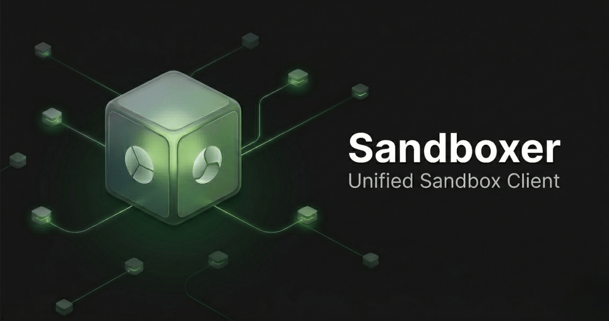

<div align="center">



# Sandboxer

**One way to work with remote sandboxes** from your application. Pick a host
(E2B, Daytona, Blaxel, Runloop, Fly Machines, or **Docker on your machine**),
and use the same mental model in **Go**, **Python**, and **TypeScript**: open a
sandbox, run commands, read and write files, and tear down when you are done.

[E2B](https://e2b.dev) · [Daytona](https://daytona.io) · [Blaxel](https://blaxel.ai) · [Runloop](https://runloop.ai) · [Fly Machines](https://fly.io/products/machines)

</div>

## Overview

Sandboxer is a family of client libraries. Each library talks **directly** to
the provider you configure. There is no separate Sandboxer service in the
request path: your credentials go to the vendor API (or to the `docker` CLI for
local sandboxes).

Use it when you are building **automation, agents, CI, or internal tools** that
need isolated environments without maintaining one integration per vendor.

## Documentation

| Language   | Reference                                 | Examples                                    |
| ---------- | ----------------------------------------- | ------------------------------------------- |
| Go         | [Reference](docs/reference-go.md)         | [examples/go](examples/go/)                 |
| Python     | [Reference](docs/reference-python.md)     | [examples/python](examples/python/)         |
| TypeScript | [Reference](docs/reference-typescript.md) | [examples/typescript](examples/typescript/) |

## Install

```bash
go get github.com/hyperterse/sandboxer/sdks/go   # version: see sdks/go/go.mod
pip install sandboxer                            # Python 3.10+
npm install sandboxer                            # when published; see sdks/typescript/README.md
```

From a clone of this repository: run `bun install`, `bun run install:python`,
and `bun run build:typescript`, or point your Go module at `sdks/go` (see
[examples/go/go.mod](examples/go/go.mod) for a `replace` example). Scripts are
listed in the root [`package.json`](package.json).

## Providers: base URL and credentials

Set **`base_url`** / **`baseUrl`** and the API key or token your provider
expects when you construct the client. Typical origins:

| Provider     | Typical base URL              | Notes                                                                                  |
| ------------ | ----------------------------- | -------------------------------------------------------------------------------------- |
| E2B          | `https://api.e2b.app`         | API key (header handled in the driver)                                                 |
| Daytona      | `https://app.daytona.io/api`  | Bearer token                                                                           |
| Blaxel       | `https://api.blaxel.ai/v0`    | Bearer or API key; optional `X-Blaxel-Workspace` (`BL_WORKSPACE` / `BLAXEL_WORKSPACE`) |
| Runloop      | `https://api.runloop.ai/v1`   | Bearer                                                                                 |
| Fly Machines | `https://api.machines.dev/v1` | Bearer (`FLY_API_TOKEN`)                                                               |
| local        | _not used_                    | Host `docker` CLI; no remote API key                                                   |

Exact environment variables and headers live in each provider under
`sdks/*/providers/`. Treat API keys like any other secret: store them in your
secret manager or environment, not in source control.

## Quick start: Go

```go
import (
    "context"
    "fmt"
    "log"

    "github.com/hyperterse/sandboxer/sdks/go"
    _ "github.com/hyperterse/sandboxer/sdks/go/providers"
)

func main() {
    ctx := context.Background()
    p, err := sandboxer.NewProvider(sandboxer.Config{Provider: sandboxer.ProviderLocal})
    if err != nil {
        log.Fatal(err)
    }
    defer p.Close()

    sb, _, err := p.CreateSandbox(ctx, sandboxer.CreateSandboxRequest{
        Provider: sandboxer.ProviderLocal,
    })
    if err != nil {
        log.Fatal(err)
    }
    defer sb.Kill(ctx)

    res, err := sb.RunCommand(ctx, sandboxer.RunCommandRequest{Cmd: "echo hello"})
    if err != nil {
        log.Fatal(err)
    }
    fmt.Print(res.Stdout)
}
```

Change `Provider` and environment variables to target a cloud host. See
[Configuration (Go)](#configuration-go) and [examples/go](examples/go).

## Quick start: Python

```python
import os
from sandboxer import Sandboxer, RunCommandRequest

client = Sandboxer(
    "e2b",
    {
        "api_key": os.environ["E2B_API_KEY"],
        "base_url": os.environ.get("E2B_API_BASE", "https://api.e2b.app"),
    },
)
sb, info = client.create_sandbox()
try:
    print(sb.run_command(RunCommandRequest(cmd="echo hello")).stdout)
finally:
    sb.kill()
    client.close()
```

For async code, use **`AsyncSandboxer`**. To work from a clone, run
`pip install -e ./sdks/python` (see [sdks/python/README.md](sdks/python/README.md)).

## Quick start: TypeScript

```typescript
import { Sandboxer } from "sandboxer";

const client = new Sandboxer({
  provider: "e2b",
  config: {
    apiKey: process.env.E2B_API_KEY!,
    baseUrl: process.env.E2B_API_BASE ?? "https://api.e2b.app",
  },
});
const [sb, info] = await client.createSandbox({ timeoutSeconds: 600 });
try {
  console.log(
    (await sb.runCommand({ cmd: "echo hello from typescript" })).stdout,
  );
} finally {
  await sb.kill();
  await client.close();
}
```

Types and errors ship from the same module; see
[docs/reference-typescript.md](docs/reference-typescript.md).

## Files and binary payloads

Some providers send file bodies as **base64** inside JSON. In **Go**, file APIs
use **`[]byte`**. Behavior depends on the host you choose.

## Errors and feature coverage

Python and TypeScript raise typed errors (see `sandboxer.errors` in the Python
package and `errors.ts` in TypeScript). **Go** uses values such as
**`sandboxer.ErrNotSupported`** in
[`sdks/go/core/errors.go`](sdks/go/core/errors.go). Not every method is
available on every provider; handle errors and check support for your workload.

## Configuration (Go)

[`sandboxer.Config`](sdks/go/core/config.go) reads **`SANDBOXER_PROVIDER`**,
**`SANDBOXER_API_KEY`**, **`SANDBOXER_BASE_URL`**, **`SANDBOXER_DEFAULT_TIMEOUT`**,
and optional TLS or OAuth-related variables. Details:
[Go reference — Configuration](docs/reference-go.md#configuration).

## Troubleshooting

| What you see                            | What to try                                                                                                                  |
| --------------------------------------- | ---------------------------------------------------------------------------------------------------------------------------- |
| Go `unknown provider`                   | Set `SANDBOXER_PROVIDER` to `local`, `e2b`, `daytona`, `runloop`, `fly-machines`, or `blaxel`, and blank-import `providers`. |
| Local sandbox does not start            | Confirm `docker info` succeeds on the host.                                                                                  |
| 401 or 403 from the host                | Match API key, token, and base URL to that vendor’s documentation.                                                           |
| Python `ModuleNotFoundError: sandboxer` | Run `pip install -e ./sdks/python` or `pip install sandboxer`.                                                               |
| TypeScript import errors                | Build `sdks/typescript` or install the package name from `sdks/typescript/package.json`.                                     |

Local development and CI: [CONTRIBUTING.md](CONTRIBUTING.md).

---

[Contributing](CONTRIBUTING.md) · [Issues](https://github.com/hyperterse/sandboxer/issues)
